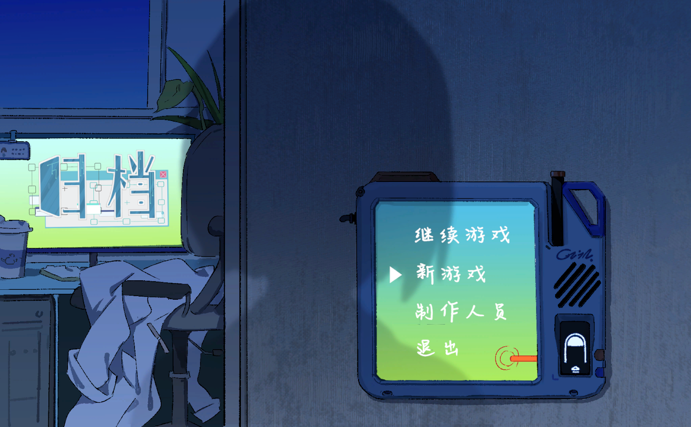
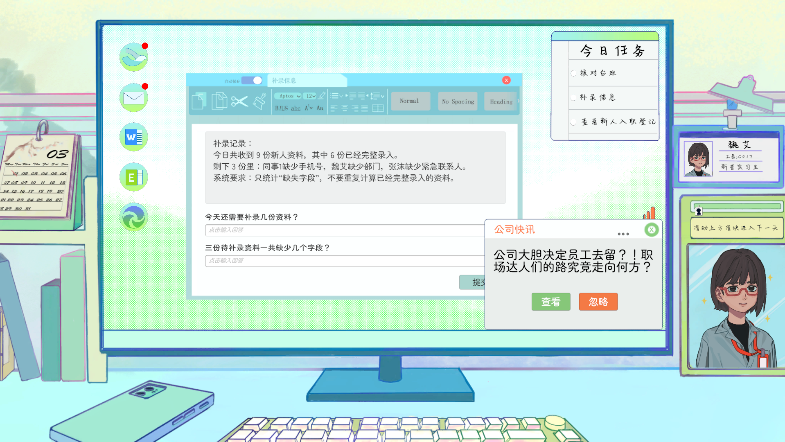
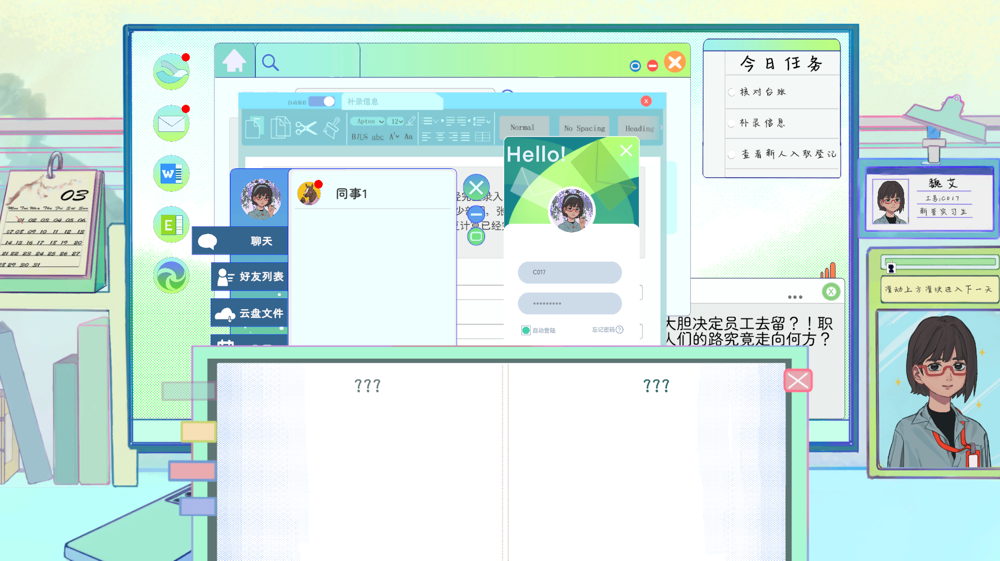
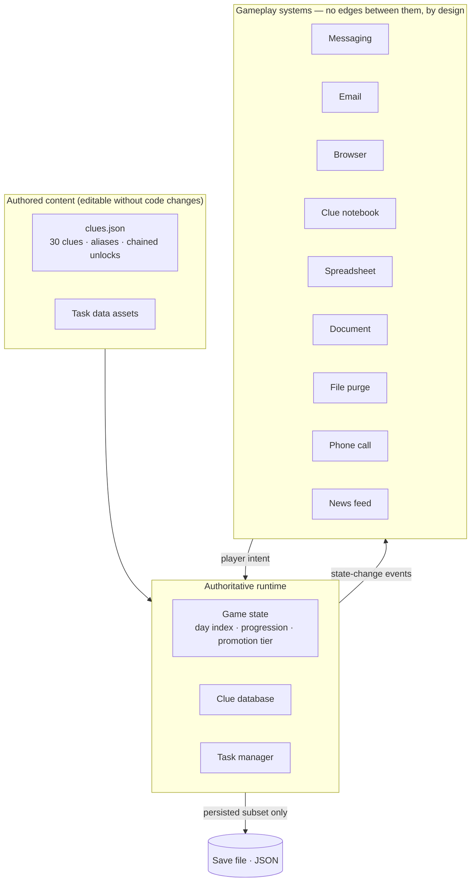
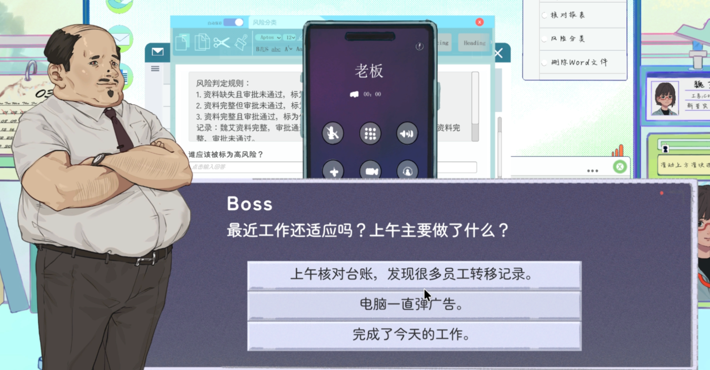
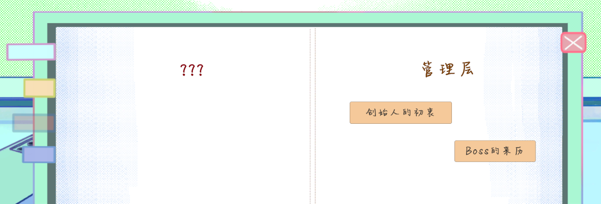
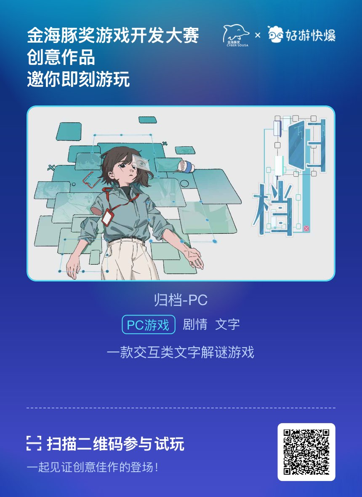

# Archived

A 20-day workplace simulation built as a **gameplay systems** project in Unity 6.
The player works through a simulated corporate desktop, completes daily tasks, and
pieces together what the company is actually doing to its employees.


<!-- IMAGE 1: hero -->


---

## Contents

- [Overview](#overview)
- [Gameplay Systems](#gameplay-systems)
- [Runtime Architecture](#runtime-architecture)
- [Progression System](#progression-system)
- [Content Pipeline](#content-pipeline)
- [Early Prototyping](#early-prototyping)
- [Project Structure](#project-structure)
- [Build & Run](#build--run)

---

## Overview

The whole game is a fake operating system. Everything the player does happens through
simulated desktop applications, so the engineering problem was never "draw a level",
it was: **how do nine independent interactive systems share one authoritative game
state, stay independent of each other, and stay cheap to change?**

The entire 20-day loop runs inside **two scenes**. There is no scene load between the
desktop, the minigames, the notebook, or the cutscenes, which means runtime state is
continuous for the whole session and no system needs to serialize itself just to
survive navigation.

<!-- IMAGE 2: desktop -->



---

## Gameplay Systems

Nine interactive systems, each self-contained and driven by the shared runtime state:

| System | What the player does | Engineering note |
|---|---|---|
| Messaging | Branching conversations with coworkers | Conversation state separated from view; runtime state survives reopening |
| Email | Read, triage, and act on mail | Mail entries built from data; list rebuilt on state change |
| Browser | Free-text search that surfaces clues | Player-typed queries resolved against authored aliases |
| Clue notebook | Collect, read, and cross-reference 30 clues | Paginated view over the live clue set |
| Spreadsheet minigame | Find anomalous cells under time pressure | Cell views built from data, click callbacks injected |
| Document minigame | Fill in redacted report text | Question set authored as data |
| File purge minigame | Delete the "right" files | Per-item flags for selectability, deleted state, and correct-target |
| Phone call | Timed dialogue choices with the boss | Choice branching driven by the same progression state |
| News feed | Scheduled in-world news popups | Day-gated content triggers |

<!-- IMAGE 3: systems grid -->


<!-- IMAGE 4: minigame -->


---

## Runtime Architecture

One authoritative runtime layer owns player progression and world state. Gameplay
systems **observe and react** to it rather than calling each other.



Why it is built this way:

- **Systems never reference each other.** A new app can be dropped in by subscribing
  to state changes. Nothing existing has to be edited.
- **Views receive their behavior, not their data source.** List items and cells are
  configured with injected callbacks, so the same view component is reused across
  systems.
- **Persisted state is deliberately smaller than runtime state.** Only what has to
  survive a session is serialized; everything else is rebuilt on load. This keeps the
  save format stable while systems churn.

That last point was the main tradeoff of the project. Serializing everything would
have been faster to write and would have frozen the save format two days in, at a
point when half the systems did not exist yet.

---

## Progression System

A day-indexed progression state machine drives the 20-day loop.

- **20 in-game days**, each with its own task set and unlock conditions
- **Five promotion tiers**, derived from the current day rather than stored separately,
  so progression cannot desync from the day counter
- Day transitions gate content across every system at once: new mail, new contacts,
  new searchable clues, new minigames


<!-- IMAGE 7: day transition -->


---

## Content Pipeline

Every gameplay system is content-driven. All nine read from external JSON under
`Assets/Resources/`, so adding a conversation, an objective, a clue, or a minigame
question needs **no code change and no recompile**.

| File | Drives | Authored content |
|---|---|---|
| `feishu_conversations.json` | Messaging | 15 conversations as node graphs |
| `boss_phone_calls.json` | Phone call | 4 calls with branching player choices |
| `tasks.json` | Daily objectives | 48 typed tasks, day-indexed |
| `clues.json` | Clue notebook + browser | 30 clues, aliases, chained unlocks |
| `email_mails.json` | Email | Per-day mail |
| `news_popups.json` | News feed | Day-gated popups |
| `excel_find_anomaly_tasks.json` | Spreadsheet minigame | Anomaly sets |
| `word_fill_tasks.json` | Document minigame | Question sets |
| `delete_folder_files.json` | File purge minigame | File manifests and correct targets |
| `feishu_conversations_example.json` | — | Authoring template |

### Dialogue as a node graph

Conversations are not text tables. Each is a graph of nodes linked by `next`, gated by
`unlockDay`, with authored pacing so messages arrive the way a real chat does.

```jsonc
{
  "conversationId": "day1_coworker_warning",
  "unlockDay": 1,                 // gated by the progression state machine
  "contactName": "...",
  "firstNodeId": "start",
  "nodes": [
    {
      "id": "start",
      "speaker": "other",
      "text": "...",
      "bubbleSize": 1,            // presentation hint
      "delay": 0.5,               // seconds before this message lands
      "next": "start_part2"       // edge to the next node
    }
  ]
}
```

Phone calls use the same runner with branching added: a node carries `choices`, and
each choice is an edge into a different branch.

```jsonc
{
  "id": "start",
  "text": "...",
  "choices": [
    { "text": "...", "next": "transfer_records" },
    { "text": "...", "next": "popup_ads" },
    { "text": "...", "next": "work_done" }
  ]
}
```

<!-- IMAGE 5: dialogue in game -->


### Clues as an unlock graph

Clues carry alias lists so player-typed searches resolve correctly, and chained
unlocks so finding one clue can expose the next.

```jsonc
{
  "clueId": 1,
  "searchable": true,
  "unlockClueIdOnSearch": 7,      // finding this clue reveals clue 7
  "aliases": ["...", "..."]        // alternate phrasings the player might type
}
```

<!-- IMAGE 8: notebook -->


Over a 2.5-week build this is what kept iteration cheap: rewording a conversation,
retiming a message, rewiring the unlock graph, or adding a day of objectives was a
text edit, not a code-edit-rebuild cycle.

---

## Early Prototyping

Before the desktop existed, a custom editor tool stood up a playable vertical slice
from code: it generated the task content assets, built the UI hierarchy, wired the
systems together, and saved the scene. Run it from
`Tools ▸ Employee Handbook ▸ Build Stage 1 Prototype`.

The slice it builds was superseded. The shipped game uses a different scene structure
and the tool has not been part of the build since day 2. It is kept in the repo
because it is the reason iteration was cheap early on: the prototype was re-buildable
from code instead of hand-wired every time it changed.

---

## Project Structure

```
Assets/
  Scenes/
    HomePage.unity        # title / continue
    MainPage.unity        # the entire game
  Scripts/
    Core/                 # game manager, player state, save, launch handoff
    Tasks/                # daily task definitions and tracking
    ClueSystem/           # clue database, notebook, unlock popups
    Browser/              # search interface
    Email/                # mail client
    Feishu/               # messaging, calendar, profile, file purge
    OfficeGames/          # spreadsheet + document minigames
    Phone/                # boss call sequences
    NewsPopup/            # in-world news
    UI/                   # shared UI, transitions, cutscenes
  Editor/                 # early prototype scene builder (not in the shipped build)
  Resources/              # 10 JSON files driving all 9 systems
    feishu_conversations.json
    boss_phone_calls.json
    tasks.json
    clues.json
    ...
```

---

## Build & Run

- Unity **6** (URP 2D)
- Open the project, load `Assets/Scenes/HomePage.unity`, press Play
- Save data is written to `Application.persistentDataPath`

---

## Scope

Solo project: all code, systems, and content pipeline. Art and audio assets are
placeholder or licensed.

---

## Play It Directly

Scan to open it on a phone:

<!-- IMAGE 10: QR code -->

